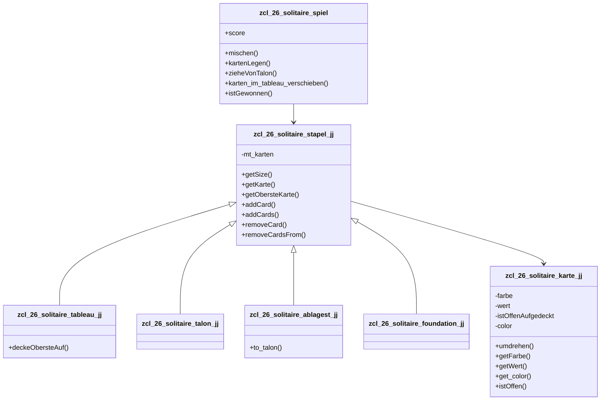

# Solitaire ABAP Projekt

Stand: 2026-05-05

Tags: #ABAP #OOP #Solitaire #UnitTests #DependencyInjection #Refactoring

## Kurzbeschreibung

Dieses Projekt modelliert ein Solitaire-Spiel in ABAP Objects. Es gibt aktuell noch keine grafische Oberflaeche. Der Fokus liegt auf der fachlichen Spiellogik: Karten, Stapel, Tableau, Talon, Ablagestapel, Foundation und Spielsteuerung.

Die aktuelle Arbeitskopie fuer lesbaren Code liegt im Ordner:

```text
Eclipse_TXT_Export
```

Dort liegen einzelne `.txt`-Dateien pro Klasse sowie eine Sammeldatei:

```text
alle_klassen.txt
```

Fuer die manuelle Arbeit mit Eclipse/ADT ist es aktuell am intuitivsten, mit den einzelnen `.txt`-Dateien zu arbeiten und Codeabschnitte gezielt nach Eclipse zu uebernehmen.

## Projektstruktur

Aktuelle Klassen:

```text
zcl_26_solitaire_karte_jj
zcl_26_solitaire_stapel_jj
zcl_26_solitaire_tableau_jj
zcl_26_solitaire_talon_jj
zcl_26_solitaire_ablagest_jj
zcl_26_solitaire_foundation_jj
zcl_26_solitaire_spiel
zcl_26_solitaire_spieler_jj
```

Die Klassen bilden bereits eine sinnvolle Domaenenstruktur ab. Besonders gut ist, dass Karten und Stapel nicht einfach als Tabellen im Spiel existieren, sondern als eigene Objekte modelliert wurden.

## Fachliches Modell

### Karte

Klasse:

```text
zcl_26_solitaire_karte_jj
```

Eine Karte besitzt aktuell:

- Farbe, z. B. `HERZ`, `KARO`, `KREUZ`, `PIK`
- Wert von 1 bis 13
- Offen/verdeckt Status
- Kartenfarbe im Sinne von Solitaire-Regeln, also `ROT` oder `SCHWARZ`

Wichtige Methoden:

```abap
constructor
umdrehen
getFarbe
getWert
get_color
istOffen
```

Bewertung:

- Die Klasse ist klein und fachlich gut abgrenzbar.
- Fuer diese Klasse ist aktuell kein Interface noetig.
- Eine Karte ist ein gutes Value-/Domaenenobjekt.
- Die Methode `umdrehen` passt gut hierher, weil die Karte ihren eigenen Status verwaltet.

Moegliche spaetere Verbesserung:

- Einheitliche Namenskonvention verwenden, z. B. `get_farbe`, `get_wert`, `ist_offen`.
- Konstanten fuer Farben/Werte eventuell zentralisieren, falls sie in mehreren Klassen gebraucht werden.

### Abstrakter Stapel

Klasse:

```text
zcl_26_solitaire_stapel_jj
```

Diese Klasse ist die gemeinsame Oberklasse fuer verschiedene Stapelarten:

- Tableau
- Talon
- Ablagestapel
- Foundation

Wichtige Methoden:

```abap
getSize
getKarte
getObersteKarte
removeCard
addCard
addCards
removeCardsFrom
istZugGueltig
```

Aktueller wichtiger Architekturstand:

```abap
PRIVATE SECTION.
  DATA mt_karten TYPE ty_karten.
```

`mt_karten` ist jetzt privat. Das ist ein wichtiger Schritt, weil andere Klassen nicht mehr direkt in der internen Kartentabelle herumarbeiten sollen.

Warum das gut ist:

- Die Stapelklasse kontrolliert selbst, wie Karten gespeichert werden.
- Andere Klassen muessen Methoden verwenden.
- Spaetere Aenderungen an der internen Struktur sind leichter.
- Unit Tests koennen gezielter gegen Verhalten statt gegen interne Tabellen geschrieben werden.

## Bedeutung von `removeCardsFrom`

Methode:

```abap
removeCardsFrom
  IMPORTING iv_index TYPE i
  RETURNING VALUE(rt_karten) TYPE ty_karten.
```

Diese Methode entfernt nicht nur eine einzelne Karte, sondern alle Karten ab einem bestimmten Index bis zum Ende des Stapels.

Beispiel:

```text
Index:  1  2  3  4  5  6  7
Karte:  A  B  C  D  E  F  G
```

Aufruf:

```abap
DATA(karten) = stapel->removecardsfrom( 5 ).
```

Ergebnis:

- Entfernt werden `E`, `F`, `G`
- Zurueckgegeben wird eine Tabelle mit `E`, `F`, `G`
- Im Stapel bleiben `A`, `B`, `C`, `D`

Der Index sagt also:

> Ab welcher Position beginnt der Kartenblock, der entfernt werden soll?

Warum wird der Index nicht hochgezaehlt?

```abap
WHILE lv_index <= me->getsize( ).
  APPEND mt_karten[ lv_index ] TO rt_karten.
  DELETE me->mt_karten INDEX lv_index.
ENDWHILE.
```

Wenn z. B. Index 5 geloescht wird, rutscht die Karte von Index 6 automatisch auf Index 5 nach. Deshalb bleibt `lv_index` gleich. Die Methode loescht immer wieder die aktuelle Karte an dieser Position, bis es dort keine Karte mehr gibt.

## Tableau

Klasse:

```text
zcl_26_solitaire_tableau_jj
```

Das Tableau ist ein konkreter Stapeltyp. Im Solitaire gibt es sieben Tableau-Stapel.

Wichtige Methoden:

```abap
constructor
deckeObersteAuf
istZugGueltig
```

Aufgabe:

- Karten im Spielfeld halten
- Die oberste Karte aufdecken
- Pruefen, ob von diesem Stapeltyp theoretisch auf einen anderen Stapeltyp gezogen werden darf

Aktuelle Verbesserung:

Frueher wurde ein geerbtes oeffentliches Attribut `karte` verwendet. Dieses wurde entfernt. Stattdessen wird in `deckeObersteAuf` eine lokale Variable verwendet:

```abap
DATA(karte) = getoberstekarte( ).
```

Das ist sauberer, weil keine unnoetige Objektvariable in der Oberklasse gebraucht wird.

## Talon

Klasse:

```text
zcl_26_solitaire_talon_jj
```

Der Talon ist der Vorratsstapel. Aus ihm wird gezogen, wenn der Spieler neue Karten braucht.

Wichtige Methode:

```abap
istZugGueltig
```

Aktuelle Rolle:

- Der Talon enthaelt die restlichen Karten nach dem Austeilen.
- Beim Ziehen wird die oberste Karte auf den Ablagestapel gelegt.

Moegliche spaetere Verbesserung:

- Die Talon-Logik koennte staerker in die Talonklasse wandern, statt in `zcl_26_solitaire_spiel`.
- Beispiel: `ziehe_karte` oder `ziehe_auf_ablagestapel`.

## Ablagestapel

Klasse:

```text
zcl_26_solitaire_ablagest_jj
```

Der Ablagestapel enthaelt Karten, die aus dem Talon gezogen wurden.

Wichtige Methoden:

```abap
istZugGueltig
to_talon
```

`to_talon` gibt alle Karten des Ablagestapels zurueck und leert den Ablagestapel:

```abap
karten = removecardsfrom( 1 ).
```

Das funktioniert, weil `removeCardsFrom( 1 )` alle Karten ab Index 1 entfernt, also den gesamten Stapel.

Moegliche fachliche Frage:

- Beim Zuruecklegen vom Ablagestapel in den Talon muss eventuell die Reihenfolge der Karten beachtet werden.
- Im echten Solitaire wird der Ablagestapel oft umgedreht oder in bestimmter Reihenfolge wieder zum Talon.

## Foundation

Klasse:

```text
zcl_26_solitaire_foundation_jj
```

Die Foundation sind die Zielstapel. Normalerweise gibt es vier Foundations, je eine pro Kartenfarbe.

Aktueller Stand:

- Klasse erbt von `zcl_26_solitaire_stapel_jj`
- Hat aktuell ein privates Attribut `zielFarbe`
- Enthaltene Logik ist noch minimal

Wichtige offene Designfrage:

Aktuell wird `zielFarbe` nicht richtig gesetzt oder genutzt. Fachlich waere es sinnvoll, dass jede Foundation weiss, fuer welche Farbe sie zustaendig ist.

Beispielidee:

```abap
METHODS constructor
  IMPORTING iv_ziel_farbe TYPE string.
```

Dann koennte man erzeugen:

```abap
foundation_herz = NEW #( iv_ziel_farbe = 'HERZ' ).
foundation_karo = NEW #( iv_ziel_farbe = 'KARO' ).
foundation_pik  = NEW #( iv_ziel_farbe = 'PIK' ).
foundation_kreuz = NEW #( iv_ziel_farbe = 'KREUZ' ).
```

## Spiel

Klasse:

```text
zcl_26_solitaire_spiel
```

Diese Klasse ist aktuell die zentrale Steuerklasse. Sie erzeugt alle Karten, erzeugt alle Stapel, mischt, teilt aus, prueft Zuege, verschiebt Karten und verwaltet den Score.

Wichtige Methoden:

```abap
constructor
mischen
kartenLegen
istGewonnen
aufgeben
zieheVonTalon
TalonAuffuellen
gueltiger_Zug_im_tableau
karten_im_tableau_verschieben
gueltiger_zug_auf_foundation
karte_to_foundation
update_score
```

Bewertung:

- Fuer den Projektstart ist es okay, dass `Spiel` viel koordiniert.
- Langfristig wird die Klasse aber wahrscheinlich zu gross.
- Sie mischt aktuell mehrere Verantwortlichkeiten:
  - Spielaufbau
  - Kartenverwaltung
  - Zugpruefung
  - Kartenbewegung
  - Score-Regeln
  - Talon/Ablagestapel-Logik

## Aktuelle Architekturentscheidung

### Interfaces fuer Unit Tests

Am 2026-05-05 wurden fuer die bestehenden Klassen `zif_*`-Interfaces angelegt.

Ziel:

- Tests koennen gegen Interface-Typen arbeiten, z. B. `REF TO zif_26_solitaire_stapel_jj`.
- Abhaengigkeiten koennen spaeter leichter durch Test-Doubles ersetzt werden.
- Die bestehenden Klassennamen und Methodenaufrufe bleiben vorerst erhalten.

Wichtige Entscheidung:

Die bestehenden Public-Methoden wurden nicht sofort aus den Klassen entfernt. Stattdessen implementieren die Klassen die neuen Interfaces und delegieren die Interface-Methoden auf die vorhandenen Methoden.

Beispiel:

```abap
METHOD zif_26_solitaire_karte_jj~getwert.
  rv_wert = getwert( ).
ENDMETHOD.
```

Warum dieser sanfte Zwischenschritt?

- Der vorhandene Code bricht nicht sofort.
- Die Klassen koennen weiterhin wie bisher verwendet werden.
- Unit Tests koennen trotzdem schon mit Interfaces beginnen.
- Ein spaeteres, konsequenteres Refactoring bleibt moeglich.

Nicht in Interfaces ausgelagert:

- Konstruktoren
- private Attribute
- interne Hilfsdaten

Das ist in ABAP normal, weil Interfaces nur das oeffentliche Verhalten beschreiben.

### Nicht fuer jede Klasse ein Interface

Aus der Schulung zu Unit Tests und Dependency Injection kam die Frage:

> Sollte jede Klasse ein Interface bekommen?

Fuer dieses Projekt lautet die Empfehlung:

> Nein, nicht mechanisch fuer jede Klasse.

Interfaces sind dann sinnvoll, wenn eine Abhaengigkeit austauschbar sein soll.

Gute Kandidaten fuer Interfaces:

- Zufall/Mischen
- UI/Eingabe/Ausgabe
- Persistenz, falls Speichern/Laden kommt
- eventuell Zugpruefung, wenn Regeln testbar ausgetauscht werden sollen

Schlechte Kandidaten fuer Interfaces:

- `Karte`, solange es nur genau eine Kartenimplementierung gibt
- einfache Domaenenobjekte ohne externe Abhaengigkeiten
- Klassen, die nicht sinnvoll gemockt oder ausgetauscht werden muessen

## Dependency Injection Kandidaten

### Mischen/Zufall

Aktueller Code in `mischen`:

```abap
DATA(random) = cl_abap_random_int=>create( seed = cl_abap_random=>seed( ) ).
```

Problem:

- Echtes Zufallsverhalten ist schwer zu testen.
- Unit Tests sollen reproduzierbar sein.

Moegliche spaetere Loesung:

```text
zif_26_solitaire_mischer
zcl_26_solitaire_random_mischer
zcl_26_solitaire_test_mischer
```

Die echte Implementierung mischt zufaellig. Die Testimplementierung gibt eine bekannte Reihenfolge zurueck.

### UI/Eingabe/Ausgabe

Wenn spaeter eine grafische Oberflaeche kommt, sollte sie nicht direkt tief in der Spiellogik stecken.

Moegliche Trennung:

- `zcl_26_solitaire_spiel` bleibt Domaenen-/Anwendungslogik
- UI zeigt Zustand an und ruft Methoden auf
- UI sollte nicht selbst Solitaire-Regeln kennen

### Zugpruefung

Aktuelle Methoden:

```abap
gueltiger_zug_im_tableau
gueltiger_zug_auf_foundation
```

Diese koennten spaeter in eine eigene Klasse:

```text
zcl_26_solitaire_zugpruefer_jj
```

Vorteil:

- Regeln sind an einer Stelle
- Unit Tests koennen sehr gezielt geschrieben werden
- `Spiel` wird kleiner

## Wichtige offene Punkte

### `entfernte_karten` wird nicht verwendet

Aktueller Code in `karten_im_tableau_verschieben`:

```abap
DATA(entfernte_karten) = von_stapel->removecardsfrom( total - anzahl + 1 ).
```

Diese Variable wird danach nicht weiter verwendet.

Warum existiert sie?

- `removeCardsFrom` gibt die entfernten Karten zurueck.
- In dieser konkreten Stelle wird der Rueckgabewert aber nicht gebraucht.

Warum ist das unschoen?

- Es sieht so aus, als sei mit den entfernten Karten noch etwas geplant.
- ABAP Cleaner oder ATC koennte melden, dass die Variable nicht verwendet wird.

Sauberere Variante:

```abap
DATA(start_index) = total - anzahl + 1.
DATA(verschobene_karten) = von_stapel->removecardsfrom( start_index ).
auf_stapel->addcards( verschobene_karten ).
```

Dann waere der echte Quellstapel die Quelle fuer die verschobenen Karten, und `karten_block` waere eventuell gar nicht mehr noetig oder haette eine klarere Rolle.

### `karten_block` Design klaeren

In `karten_im_tableau_verschieben` gibt es:

```abap
Karten_block TYPE REF TO zcl_26_solitaire_stapel_jj
auf_stapel   TYPE REF TO zcl_26_solitaire_stapel_jj
von_stapel   TYPE REF TO zcl_26_solitaire_stapel_jj
```

Fachlich ist noch etwas unklar:

- Ist `karten_block` ein echter temporaerer Stapel?
- Oder soll `karten_block` nur beschreiben, welche Karten aus `von_stapel` verschoben werden?
- Wenn die Karten bereits in `karten_block` liegen, warum muessen sie danach nochmal aus `von_stapel` entfernt werden?

Das ist ein wichtiger Punkt fuer das naechste Refactoring.

Moegliche Alternative:

```abap
METHODS karten_im_tableau_verschieben
  IMPORTING
    von_stapel  TYPE REF TO zcl_26_solitaire_stapel_jj
    auf_stapel  TYPE REF TO zcl_26_solitaire_stapel_jj
    ab_index    TYPE i.
```

Dann ist klar:

- Aus `von_stapel` werden alle Karten ab `ab_index` entfernt.
- Diese Karten werden auf `auf_stapel` gelegt.
- Es gibt keinen separaten `karten_block`, der doppelte Verantwortung erzeugt.

### `istGewonnen` prueft vermutlich falsche Stapel

Aktueller Gedanke:

In Solitaire ist das Spiel gewonnen, wenn alle vier Foundations voll sind, also jeweils 13 Karten enthalten.

Aktuell scheint `istGewonnen` Tableau-Stapel zu pruefen:

```abap
temp1 = tableau_1->getsize( ).
temp2 = tableau_2->getsize( ).
temp3 = tableau_3->getsize( ).
temp4 = tableau_4->getsize( ).
```

Vermutlich sollte es eher sein:

```abap
temp1 = foundation_pik->getsize( ).
temp2 = foundation_karo->getsize( ).
temp3 = foundation_kreuz->getsize( ).
temp4 = foundation_herz->getsize( ).
```

Das sollte fachlich geprueft und spaeter angepasst werden.

### `TalonAuffuellen` Bedingung wirkt falsch herum

Aktueller Code:

```abap
IF ablagestapel->getsize( ) < 1.
```

Das bedeutet:

> Wenn der Ablagestapel leer ist, fuelle den Talon aus dem Ablagestapel.

Das wirkt fachlich falsch. Wahrscheinlich sollte der Talon aufgefuellt werden, wenn der Ablagestapel Karten enthaelt.

Moegliche Korrektur:

```abap
IF ablagestapel->getsize( ) > 0.
```

Zusaetzlich wird `iv_karten` aktuell nicht genutzt, obwohl es als Parameter uebergeben wird.

### Leere Foundation

Aktueller Code in `gueltiger_zug_auf_foundation`:

```abap
DATA(ziel_karte) = zielstapel->getoberstekarte( ).
DATA(ziel_farbe) = ziel_karte->getfarbe( ).
DATA(ziel_wert) = ziel_karte->getwert( ).
```

Problem:

- Wenn die Foundation leer ist, gibt es keine oberste Karte.
- Dann kann `getoberstekarte` fehlschlagen.

Fachlich braucht Foundation eine Sonderregel:

- Auf eine leere Foundation darf nur ein Ass.
- Je nach Wertmodell ist Ass vermutlich Wert `1`.

Moegliche Regel:

```text
Wenn Foundation leer:
  gueltig, wenn Karte Wert 1 hat und zur Foundation-Farbe passt.

Wenn Foundation nicht leer:
  gueltig, wenn gleiche Farbe und Wert genau eins hoeher.
```

### Aufdecken nach Tableau-Zug

Aktueller Code:

```abap
DATA(karte) = von_stapel->getoberstekarte( ).
karte->umdrehen( ).
```

Problem:

- Wenn `von_stapel` nach dem Entfernen leer ist, gibt es keine oberste Karte.
- Dann kann der Zugriff fehlschlagen.
- Ausserdem sollte nur umgedreht werden, wenn die Karte verdeckt ist.

Sicherer waere:

```abap
IF von_stapel->getsize( ) > 0.
  DATA(karte) = von_stapel->getoberstekarte( ).
  IF karte->istoffen( ) = abap_false.
    karte->umdrehen( ).
  ENDIF.
ENDIF.
```

## Empfohlene naechste Refactoring-Schritte

### 1. `karten_im_tableau_verschieben` vereinfachen

Ziel:

- Keine ungenutzte Variable `entfernte_karten`
- Keine doppelte Quelle `karten_block` und `von_stapel`
- Klarer Parameter, ab welcher Karte verschoben wird

Moegliche neue Signatur:

```abap
METHODS karten_im_tableau_verschieben
  IMPORTING
    von_stapel TYPE REF TO zcl_26_solitaire_stapel_jj
    auf_stapel TYPE REF TO zcl_26_solitaire_stapel_jj
    ab_index   TYPE i.
```

### 2. Foundation-Regeln korrigieren

Ziel:

- Leere Foundation sauber behandeln
- Ass als Startkarte erlauben
- Foundation-Farbe beruecksichtigen

### 3. `istGewonnen` auf Foundations umstellen

Ziel:

- Spiel ist gewonnen, wenn alle vier Foundations 13 Karten haben.

### 4. Talon/Ablagestapel sauber modellieren

Ziel:

- `zieheVonTalon` und `TalonAuffuellen` fachlich stabilisieren
- Reihenfolge beim Ruecklegen pruefen
- Ungenutzte Parameter entfernen oder wirklich verwenden

### 5. Unit Tests fuer Regeln schreiben

Hoher Nutzen bei:

- `gueltiger_zug_im_tableau`
- `gueltiger_zug_auf_foundation`
- `karten_im_tableau_verschieben`
- `zieheVonTalon`
- `istGewonnen`

## Unit Test Ideen

### Karte

Tests:

- Neue Karte ist mit korrekter Farbe und Wert initialisiert.
- `HERZ` und `KARO` sind rot.
- `PIK` und `KREUZ` sind schwarz.
- `umdrehen` wechselt von verdeckt zu offen.
- Zweimal `umdrehen` fuehrt zum Ausgangszustand zurueck.

### Stapel

Tests:

- Neuer Stapel hat Groesse 0.
- `addCard` erhoeht Groesse.
- `getObersteKarte` gibt zuletzt hinzugefuegte Karte zurueck.
- `removeCard` entfernt oberste Karte.
- `removeCardsFrom( 1 )` leert den ganzen Stapel.
- `removeCardsFrom( 3 )` entfernt nur Karten ab Index 3.

### Tableau-Regeln

Tests:

- Auf leeres Tableau darf nur Koenig.
- Auf rote Karte darf nur schwarze Karte mit Wert eins niedriger.
- Auf schwarze Karte darf nur rote Karte mit Wert eins niedriger.
- Gleiche Farbe ist ungueltig.
- Falscher Wert ist ungueltig.

### Foundation-Regeln

Tests:

- Auf leere Foundation darf nur Ass.
- Auf Foundation darf nur gleiche Farbe.
- Naechster Wert muss genau eins hoeher sein.
- Falsche Farbe ist ungueltig.
- Falscher Wert ist ungueltig.

### Talon/Ablagestapel

Tests:

- Ziehen vom Talon reduziert Talon um 1.
- Ziehen vom Talon erhoeht Ablagestapel um 1.
- Wenn Talon leer ist, wird aus Ablagestapel aufgefuellt.
- Reihenfolge beim Auffuellen ist korrekt.

## Architektur-Notizen

### Aktuelle Staerke

Das Projekt hat bereits eine gute fachliche Zerlegung:

- Karte als eigenes Objekt
- Stapel als abstrakte Oberklasse
- Spezialstapel als Unterklassen
- Spiel als Koordinator

Das ist ein guter Start fuer ABAP OO.

### Hauptgefahr

Die Klasse `zcl_26_solitaire_spiel` kann zu gross werden.

Sie sollte langfristig eher koordinieren als jedes Detail selbst entscheiden.

### Gute Zielrichtung

Kurzfristig:

- Kapselung verbessern
- offensichtliche fachliche Fehler korrigieren
- Tests fuer Regeln schreiben

Mittelfristig:

- Zugpruefung auslagern
- Mischen abstrahieren
- UI sauber von Spiellogik trennen

Langfristig:

- Spielzustand sauber abfragbar machen
- Oberflaeche bauen
- eventuell Speichern/Laden

## Moegliche Zielarchitektur

```text
zcl_26_solitaire_spiel
  koordiniert Spielablauf
  besitzt Tableaus, Talon, Ablagestapel, Foundations

zcl_26_solitaire_zugpruefer_jj
  prueft Solitaire-Regeln

zcl_26_solitaire_mischer_jj
  mischt Karten

zcl_26_solitaire_score_jj
  verwaltet Score-Regeln, falls diese wachsen

zcl_26_solitaire_stapel_jj
  kapselt Kartenliste

zcl_26_solitaire_karte_jj
  modelliert einzelne Karte
```

## Mermaid Klassenskizze



## Lernnotizen

### Kapselung

Kapselung bedeutet:

> Eine Klasse schuetzt ihren inneren Zustand und erlaubt Zugriff nur ueber Methoden.

Im Projekt ist `mt_karten` ein gutes Beispiel.

Nicht optimal:

```abap
APPEND LINES OF karten_block->mt_karten TO auf_stapel->mt_karten.
```

Besser:

```abap
DATA(karten) = von_stapel->removecardsfrom( start_index ).
auf_stapel->addcards( karten ).
```

### Dependency Injection

Dependency Injection bedeutet:

> Eine Klasse erzeugt ihre Abhaengigkeiten nicht zwingend selbst, sondern bekommt sie von aussen uebergeben.

Nicht jede Klasse braucht DI.

DI lohnt sich besonders, wenn:

- die Abhaengigkeit schwer testbar ist
- die Abhaengigkeit externes Verhalten hat
- mehrere Implementierungen denkbar sind
- man im Unit Test eine Fake-/Mock-Implementierung verwenden moechte

Im Projekt ist Zufall/Mischen der beste erste DI-Kandidat.

### Unit Tests

Unit Tests sollten besonders dort geschrieben werden, wo Regeln stecken.

Im Solitaire-Projekt sind das vor allem:

- Tableau-Regeln
- Foundation-Regeln
- Talon/Ablagestapel-Verhalten
- Gewinnbedingung

## Offene Aufgaben

- [ ] `karten_im_tableau_verschieben` fachlich vereinfachen
- [ ] `entfernte_karten` entfernen oder sinnvoll verwenden
- [ ] `istGewonnen` auf Foundation-Stapel umstellen
- [ ] `TalonAuffuellen` Bedingung pruefen
- [ ] `iv_karten` in `TalonAuffuellen` verwenden oder Parameter entfernen
- [ ] Leere Foundation in `gueltiger_zug_auf_foundation` behandeln
- [ ] Sicherstellen, dass nach einem Tableau-Zug nur aufgedeckt wird, wenn noch eine Karte vorhanden ist
- [ ] Erste Unit Tests fuer `Karte` schreiben
- [ ] Unit Tests fuer `Stapel` schreiben
- [ ] Unit Tests fuer Tableau-Regeln schreiben
- [ ] Entscheiden, ob `zcl_26_solitaire_zugpruefer_jj` eingefuehrt wird
- [ ] Entscheiden, ob `zcl_26_solitaire_mischer_jj` oder Interface fuer Mischen eingefuehrt wird

## Naechster sinnvoller Schritt

Der naechste sinnvollste technische Schritt ist wahrscheinlich:

> `karten_im_tableau_verschieben` so umbauen, dass direkt aus dem Quellstapel ab einem Index entfernt und auf den Zielstapel gelegt wird.

Warum?

- Dadurch wird `entfernte_karten` ueberfluessig.
- Die Methode wird fachlich klarer.
- Die Rolle von `karten_block` kann entfallen oder spaeter klarer definiert werden.
- Das passt gut zur neuen Kapselung von `mt_karten`.

Danach waere ein guter zweiter Schritt:

> Foundation-Regeln korrigieren und Unit Tests dafuer schreiben.

## Aktualisierung 2026-05-15

Der aktuelle ADT-Stand ist weiter als der alte Text-Export:

- `zif_26_solitaire_constants_jj` wurde ergaenzt und enthaelt Kartenfarben, Kartenfarbenlogik und Score-Aktionsnamen.
- `zcl_26_solitaire_spiel` verwendet inzwischen das Interface `zif_26_solitaire_spiel_jj`.
- `zcl_26_solitaire_spiel` bietet Getter fuer Tableau, Talon und Ablagestapel:
  - `get_tableau`
  - `get_talon`
  - `get_ablage`
- Es gibt ABAP-Unit-Tests fuer Score, Mischen, Kartenlegen, Talon/Ablage, Tableau-Zuege und Foundation-Zuege.
- `talon_auffuellen` nutzt jetzt den Parameter `iv_karten`; die alte TODO-Notiz dazu ist damit erledigt.

Die Dateien im Ordner `Eclipse_TXT_Export` wurden aus den aktuellen `.aclass`- und `.aint`-Quellen neu aktualisiert.

### Stabilitaetsbewertung

Der Code ist stabil genug, um als naechsten Schritt ein Scoreboard zu bauen.

Warum:

- Spielername ist ueber `zcl_26_solitaire_spieler_jj->get_name( )` verfuegbar.
- Punkte werden in `zcl_26_solitaire_spiel->score` bereits zentral gehalten.
- Score-Aktionen sind ueber Konstanten benannt.
- Die Spielklasse hat erste Getter, die spaeter auch fuer UI und Spielumgebung wichtig sind.

Aber: Die Spiellogik ist noch nicht komplett stabil.

Wichtige offene Punkte bleiben:

- `ist_gewonnen` prueft noch `tableau_1` bis `tableau_4`. Fachlich sollten die vier Foundation-Stapel geprueft werden.
- `ist_foundation_zug_gueltig` ruft sofort `ziel_stapel->get_oberste_karte( )` auf. Bei leerer Foundation kann das fehlschlagen. Fachlich muss eine leere Foundation ein Ass erlauben.
- `karten_im_tableau_verschieben` nutzt weiterhin `karten_block` und entfernt danach nochmal aus `von_stapel`. Das funktioniert in den aktuellen Tests, bleibt aber fachlich doppeldeutig.
- Nach dem Verschieben wird direkt `von_stapel->get_oberste_karte( )` aufgerufen. Wenn der Quellstapel leer wird, ist das riskant.
- Der Test `ist_nicht_gewonnen` prueft aktuell nicht wirklich das Ergebnis von `cut->ist_gewonnen( )`, sondern asserted direkt `abap_false`.

### Empfehlung: Scoreboard als naechster Schritt

Ein Scoreboard ist jetzt ein guter naechster Schritt, weil es auf vorhandenen Daten aufsetzt und nicht voraussetzt, dass die komplette UI schon existiert.

Sinnvolle erste Klasse:

```text
zcl_26_solitaire_scoreboard_jj
```

Sinnvolles erstes Interface:

```text
zif_26_solitaire_scoreboard_jj
```

Ein Scoreboard-Eintrag sollte am Anfang nur diese Daten enthalten:

```text
spielername
punkte
```

Optional spaeter:

```text
gewonnen
aufgegeben
datum
uhrzeit
spieldauer
```

Minimal sinnvolle Methoden:

```abap
METHODS add_entry
  IMPORTING
    iv_spielername TYPE string
    iv_punkte      TYPE i.

METHODS get_entries
  RETURNING VALUE(rt_entries) TYPE ty_scoreboard_entries.

METHODS clear.
```

Warum zuerst ohne Persistenz:

- Die Klasse kann sofort per Unit Test geprueft werden.
- Speichern/Laden kann danach sauber als eigene Verantwortung dazukommen.
- Die spaetere grafische Oberflaeche kann das Scoreboard direkt anzeigen.

### Aktualisierte Reihenfolge

1. Scoreboard-Klasse und Tests bauen.
2. Danach `ist_gewonnen` auf Foundations korrigieren.
3. Danach leere Foundation sauber behandeln.
4. Danach Tableau-Verschieben vereinfachen.
5. Danach Speichern des Scoreboards.
6. Danach grafische Oberflaeche / Spielenvironment.

## Erste sichtbare Oberflaeche

Es gibt jetzt einen ersten Report-Entwurf:

```text
Eclipse_TXT_Export/zrep_26_solitaire_play_jj.txt
```

Ziel des Reports:

- Spielername auf dem Selektionsbild eingeben
- Spiel erzeugen
- Karten mischen und legen
- Tableaus anzeigen
- Talon und Ablage anzeigen
- laufenden Score anzeigen
- einfache Hilfe anzeigen
- mit Aktion `TALON` Karten vom Talon ziehen
- mit Aktion `QUIT` einen Scoreboard-Eintrag erzeugen

Der Report ist bewusst einfach gehalten. Er ist die erste sichtbare Oberflaeche, keine fertige GUI.

Wichtige Einschraenkung:

Der Report startet pro Ausfuehrung ein neues Spiel. Damit dauerhaft ueber mehrere Aktionen weitergespielt werden kann, braucht das Projekt danach entweder:

- Speichern/Laden eines Spielstands
- oder eine echte Dialogoberflaeche
- oder eine interaktive Report-Variante, die den Zustand innerhalb einer laufenden Session haelt

Fuer den aktuellen Lernstand ist der Report trotzdem sinnvoll, weil man endlich sieht, ob Kartenlegen, Talon, Ablage und Score grundsaetzlich zusammenarbeiten.

Naechste sinnvolle Getter fuer eine vollstaendigere Anzeige:

```abap
get_foundation
get_score
```

`get_foundation` wuerde die vier Zielstapel sichtbar machen. `get_score` waere sauberer, als direkt auf das oeffentliche Attribut `score` zuzugreifen.
